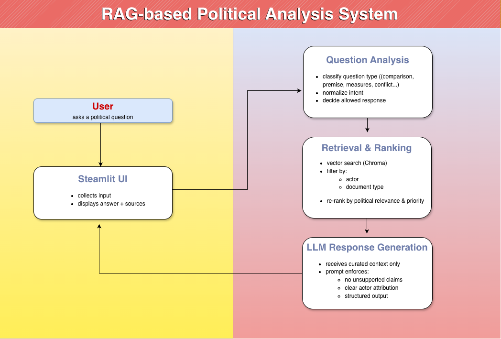
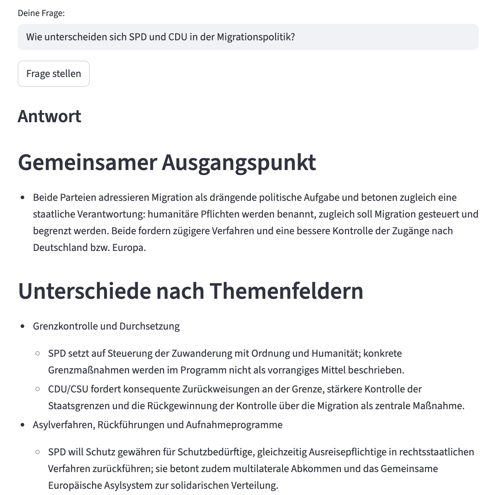
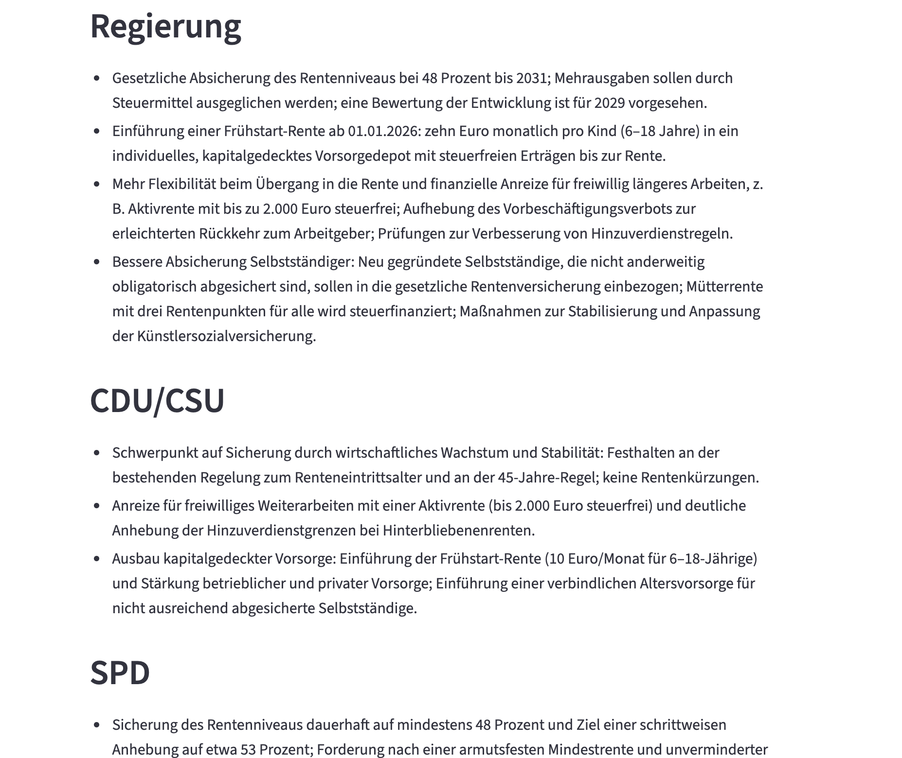
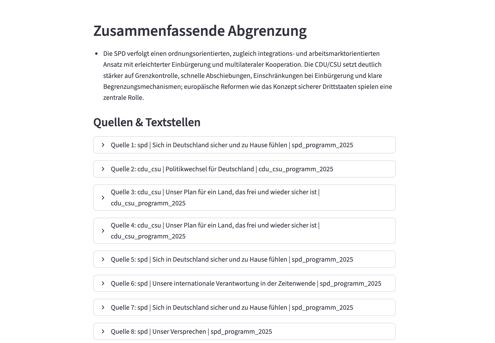
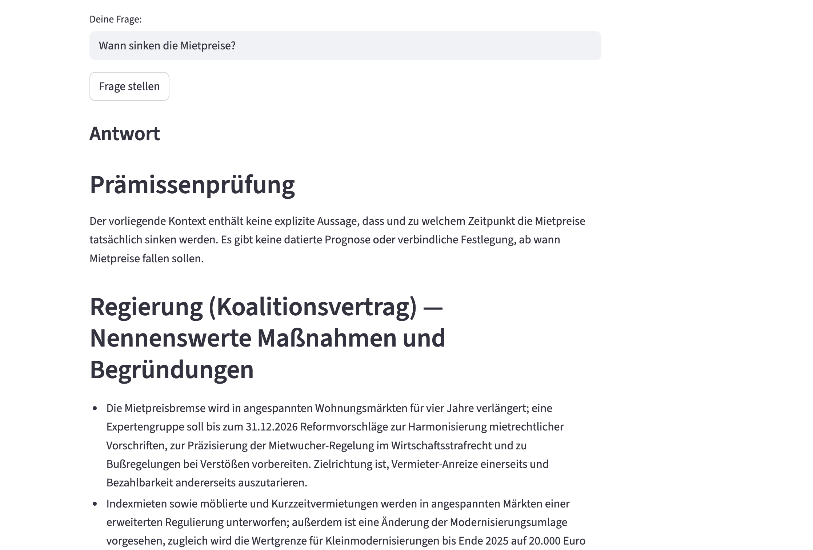
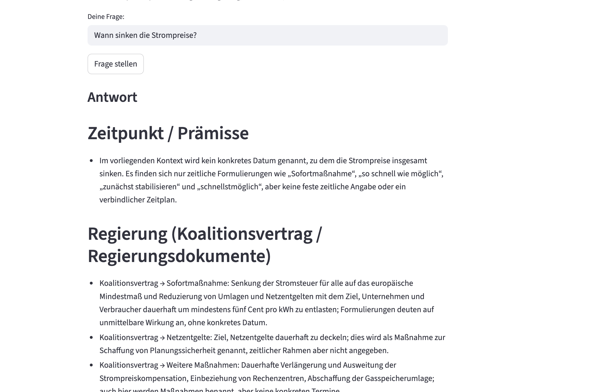

# rag-based-political-qa      [(Link)](https://rag-politik-demo-9hvadctrythe3q9v5f9qlf.streamlit.app/).
Documentation and showcase of a RAG-based political question-answering system.

## Project Overview

A detailed video explanation of the project can be found [here]([https://drive.google.com/file/d/1Qbn7r3tcOXRRPrLXTFk3xRLPrR4OyeQr/view?usp=sharing](https://drive.google.com/file/d/1oiksxA_y7D1lZZAZNL4Xnk3s0-rC9LA5/view?usp=sharing)).

### RAG-Based Political Question Answering System (Germany)

This project explores how a Retrieval-Augmented Generation (RAG) architecture can be used to support political information access based exclusively on official documents.

The system allows users to ask concrete questions about the German federal government and major political actors (SPD, CDU/CSU) and receive structured, source-bound answers without having to read extensive original documents themselves.

### Motivation

Political party programs, coalition agreements, and government documents are publicly available, but often long, complex, and fragmented across multiple sources. As a result, public debate frequently relies on simplified narratives, headlines, or unverified claims.

The goal of this project was to design a low-threshold, explanatory system that enables users to explore political positions and measures directly from primary sources, without opinionated summaries or speculative interpretations.

### Scope & Delimitation

To ensure architectural clarity and answer quality, the project intentionally focuses on:

Federal government / coalition documents

SPD

CDU/CSU

The system is conceptually extensible, but was deliberately limited in scope to prioritize controlled experimentation over completeness.

### Core Idea: Structured Political Questions

This is not a generic political chatbot.

Instead, the system acts as a structured analysis assistant that classifies political questions and applies different response strategies depending on the detected intent, including:

Comparative questions

Premise-based questions

Policy and measure-related questions

Government responsibility questions

Conflict and tension-related questions

This allows the system to avoid misleading answers (e.g. normative judgments where the source material does not justify them).

### System Design (Conceptual)

The project follows a Retrieval-Augmented Generation (RAG) architecture:

Official, publicly available political documents as the sole knowledge base

Vector-based document retrieval

Document weighting and re-ranking based on political relevance

Strict context binding: answers are limited to explicitly retrievable information

Clear actor attribution instead of free-form summarization

A particular focus was placed on distinguishing document types (e.g. party programs vs. coalition agreements) and modeling political priority differences algorithmically.

### Key Insights

The project demonstrates that RAG systems can support political structuring and contextualization, provided that:

- question intent is reliably detected

- descriptive statements are clearly separated from normative evaluation

- conflicts and tensions are only surfaced when explicitly supported by sources

Compared to generic political Q&A systems, the strength of this approach lies in:

- methodological transparency

- controlled information density

- structured reasoning instead of surface-level summaries

### Demo Notes

For demo purposes, the vector database is prebuilt and loaded from external storage to allow instant interaction without preprocessing.

The goal is to demonstrate architecture, document weighting, and retrieval logic without running time- and cost-intensive embedding pipelines at startup.

Index creation is conceptually part of the system but intentionally externalized in this demo setup. 

### Future Extensions

The system is designed to be modular and extensible, for example by:

- integrating additional parties or parliamentary factions

- expanding to state-level or EU-level documents

- supporting follow-up questions and longer dialogue flows

- refining document classification with larger corpora

### Disclaimer

This project is provided for demonstration and evaluation purposes only.
It is not intended as a political recommendation system or a substitute for independent political judgment.

## [Test it!](https://rag-politik-demo-9hvadctrythe3q9v5f9qlf.streamlit.app/)
